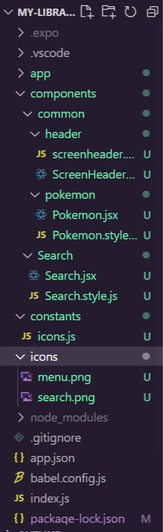

# cs732-se75-assignment-yzhzyyy
cs732-se75-assignment-yzhzyyy created by GitHub Classroom

# Topic: Using React Native and Expo to Creact a Mobile Application  

## What is React Native (RN)?  

#### 1. Introduction  
  RN is a derivative of React for native mobile application platforms and an open-source UI software framework. Based on JavaScript mobile framework, RN can be used to develop applications for iOS and Android platforms. Additionally, RN allows us to write only one codebase that can be applied to both iOS and Android. 
  Some advantages of using RN:  
  i) Easy  
  ii) Reusable components  
  iii) One-way data binding, easy to debug large-scale applications.  

#### 2. Difference Between React and React Native  

|  | React | React Native |
| --- | --- | --- |
| User interface | HTML tags | JSX tags |
| Style | CSS | JavaScript |
| Randering | virtual DOM | native APIs |
| Route | React Router | Navigator library | 

## What is expo?  
  Expo is a set of tools, libraries, and services for building native iOS and Android applications using JavaScript.  
  Expo allows for rapid iteration and testing across different mobile platforms.  
  
# 'My-Library' App

## 1. User Guide  

**Step 1**: Download the project file and open it with a code editor (using VSCode as an example).  
**Step 2**: Open the terminal in VSCode and enter the following code to install the necessary tools.  

## 2. Project Files Overview
 

> * `/app`:  It stores the main display pages, including the `index.js` and `modal.js` page.  
> * `/components`:  It stores the components used in the project, including three custom components: `ScreenHeaderBtn`, `Pokemon`, and `Search`.  
> * `/constants`:  It stores `icons.js`, which is used to make the image resources constant so that they can be accessed directly in the project without specifying their paths again.  
> * `/images`: It stores the images used in the project.  
> * `pokemon.json`: Store Pokemon information using an array, including id, url, and name.

 

## 3. Details

### _layout.js
In this file, I created a React functional component called `Layout` which defines a stack navigation using the Expo Router library. This Component returns a `Stack` component. There are two screens defined within the `Stack` component: `home` and `modal`. The `home` screen represents the main content and the `modal` screen represents a modal that can be displayed on top of the main content.   The Expo Router library provides navigation functionality for moving between screens in the stack.

### home.js
This file implements the redirection functionality.  When the stack in `_layout.js` pushes out the home page, the index component in `home.js` is called, which uses the `Redirect` component to redirect to `index.js`.   In `index.js`, the actual home page is defined. This enables the mobile end to display the main page. 

### index.js
This is the main page of the mobile app. 
It uses various components such as `Stack`, `SafeAreaView`, `LinearGradient`, `ScrollView`, `ScreenHeaderBtn`, `Search`, and `Pokemon` to create a user interface with a header section and a body section. 
> **Components** 
> * `SafeAreaView`:  SafeAreaView is provided by `react-native-safe-area-context`. It ensures that the content is displayed within the safe areas of the device's screen. This is important because on devices like the iPhone X or newer models, the top screen notch can obstruct a portion of the screen. SafeAreaView helps prevent content from being obstructed by the device's hardware, and ensures that it is displayed within the visible screen area.
> * `LinearGradient`:  LinearGradient is provided by the `Expo` library for creating a linear gradient effect by specifying a range of colors and positions along a linear axis. 
> * `ScrollView`:  ScrollView is provided by  `react-native-gesture-handler`. It provides a scrollable view for displaying content that is larger than the visible area of the screen.  `showsVerticalScrollIndicator={false}` means hide the display of the vertical scroll bar in this component. 
> * `ScreenHeaderBtn`,`Search` and `Pokemon` are three custom components, which will be explained later.

